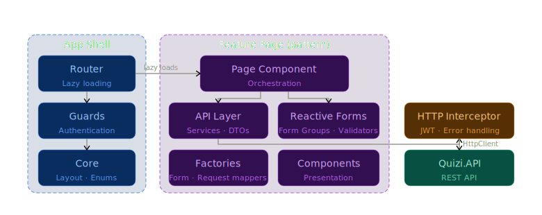

<div align="center">

# 🎯 Quizi

### Aplikacja internetowa do przeprowadzania quizów

[](https://angular.io/)
[](https://material.angular.io/)
[](https://github.com/lukasz-porebski/Quizi.API)

### 🌐 [Zobacz aplikację](https://quizi-web-228453964568.us-central1.run.app)

</div>

---

Quizi to samodzielnie rozwijany projekt portfolio, będący trzecią iteracją aplikacji do przeprowadzania quizów. Warstwa UI zbudowana jest w oparciu o Angular 21 z wykorzystaniem Angular Material i komunikuje się z REST API. Projekt jest rozwijany od stycznia 2025.

---

## 📑 Spis treści

- [🏗️ Architektura](#️-architektura)
- [⚙️ Technologie](#️-technologie)
- [☁️ Deployment](#️-deployment)
- [✨ Dostępne funkcje](#-dostępne-funkcje)
- [🔗 Powiązane repozytoria](#-powiązane-repozytoria)
- [🛠️ Narzędzia](#️-narzędzia)
- [🚀 Planowane funkcje](#-planowane-funkcje)

---

## 🏗️ Architektura



---

## ⚙️ Technologie

- 🔴 **Angular 21** - framework
- 🎨 **Angular Material** - komponenty UI
- 🅱️ **Bootstrap** - style i układ

---

## ☁️ Deployment

Aplikacja jest wdrożona na **Google Cloud Platform** z wykorzystaniem w pełni zautomatyzowanego pipeline'u CI/CD:

| Usługa | Rola |
|--------|------|
| 🔧 **Cloud Build** | Pipeline CI/CD |
| 🏃 **Cloud Run** | Hosting aplikacji |

### Pipeline CI/CD

```
Install dependencies → Build produkcyjny → Build obrazu Docker → Push → Deploy na Cloud Run
```

---

## ✨ Dostępne funkcje

- ✅ Lista quizów
- ➕ Dodawanie quizu
- ✏️ Edytowanie quizu
- 🗑️ Usuwanie quizu
- ▶️ Uruchamianie quizu
- 📊 Historia wyników quizów
- 👥 Lista użytkowników
- 👁️ Podgląd quizu

---

## 🔗 Powiązane repozytoria

| Repozytorium | Opis |
|---|---|
| ⚙️ [Quizi.API](https://github.com/lukasz-porebski/Quizi.API) | Warstwa backendowa aplikacji (.NET 10) |

---

## 🛠️ Narzędzia

| Kategoria | Narzędzie |
|-----------|-----------|
| 💻 IDE | **WebStorm** |
| 🌿 System kontroli wersji | **Git** |

---

## 🚀 Planowane funkcje

- 🔗 Dzielenie się quizami
- 📈 Statystyki quizów
